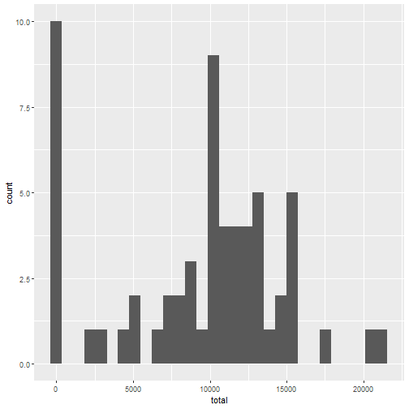
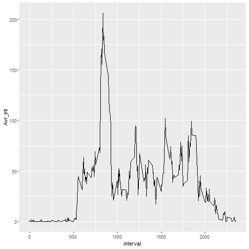
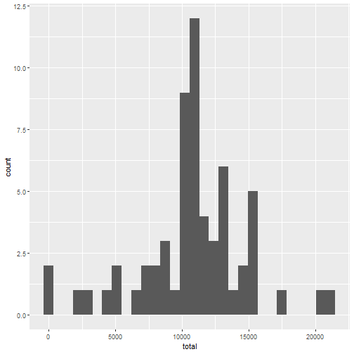
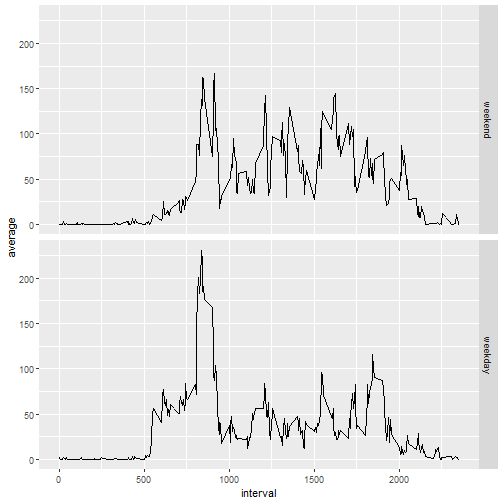

Course Project1
===============

##Loading and preprocessing the data  
unzipping the data

```r
unzip("repdata_data_activity.zip")
library(dplyr)
data <- as.tbl(read.csv("activity.csv"))
data
```

##What is mean total number of steps taken by day?  

###1. Make a histogram of the total number of steps taken each day  


```r
dly_ttl_stp <- data %>% group_by(date) %>% summarise(total = sum(steps, na.rm = TRUE)) 
library(ggplot2)
g <- ggplot(dly_ttl_stp, aes(total))
g + geom_histogram(bins = 30)
```



###2. Calculate and report the mean and median total number of steps taken per day


```r
dly_avrg_stp <- data %>% group_by(date) %>% summarise(mean = mean(steps), median = median(steps)) 
dly_avrg_stp
```

```
## # A tibble: 61 x 3
##    date         mean median
##    <fct>       <dbl>  <dbl>
##  1 2012-10-01 NA         NA
##  2 2012-10-02  0.438      0
##  3 2012-10-03 39.4        0
##  4 2012-10-04 42.1        0
##  5 2012-10-05 46.2        0
##  6 2012-10-06 53.5        0
##  7 2012-10-07 38.2        0
##  8 2012-10-08 NA         NA
##  9 2012-10-09 44.5        0
## 10 2012-10-10 34.4        0
## # ... with 51 more rows
```

##What is the average daily activity pattern?

###1. Make a time series plot (i.e. type = "l") of the 5-minute interval (x-axis) and the average number of steps taken, averaged across all days (y-axis)


```r
int_mean_stp <- data %>% group_by(interval) %>% summarise(Avr_int = mean(steps, na.rm = TRUE))
g <- ggplot(int_mean_stp, aes(interval, Avr_int))
g + geom_line()
```



###2. Which 5-minute interval, on average across all the days in the dataset, contains the maximum number of steps?


```r
int_mean_stp$interval[which.max(int_mean_stp$Avr_int)]
```

```
## [1] 835
```

##Imputing missing values  

###1. Calculate and report the total number of missing values in the dataset (i.e. the total number of rows with `NA`s)


```r
print("The number of missing values in data is:", quote = F ) 
```

```
## [1] The number of missing values in data is:
```

```r
sum(is.na(data) == TRUE)
```

```
## [1] 2304
```

###2. Devise a strategy for filling in all of the missing values in the dataset. The strategy does not need to be sophisticated. For example, you could use the mean/median for that day, or the mean for that 5-minute interval, etc.


  * We have the rows indcies of na's with `which(is.na(data$steps))` and I need to replace every `NA` with her average step by interval... I can replicate the values of the means by interval as the number of rows of the data and then fill every na with his correspendent  

 * We will replicate the values of the average number of steps in the `int_mean_stp$Avr_int` variable to be as the lenght of `data$steps` and we'll assign it to the vector `x`

```r
x <- rep(int_mean_stp$Avr_int, len = length(data$steps))
str(x)
```

```
##  num [1:17568] 1.717 0.3396 0.1321 0.1509 0.0755 ...
```
 
 * Now we will assign the values of the subset of x where `is.na(data$steps)` to the na's of `data$steps` 

```r
str(x[is.na(data$steps)])
```

```
##  num [1:2304] 1.717 0.3396 0.1321 0.1509 0.0755 ...
```
 
###3. Create a new dataset that is equal to the original dataset but with the missing data filled in  

```r
newdata <- data
newdata$steps[is.na(newdata$steps)] <- x[is.na(newdata$steps)]
str(newdata)
```

```
## Classes 'tbl_df', 'tbl' and 'data.frame':	17568 obs. of  3 variables:
##  $ steps   : num  1.717 0.3396 0.1321 0.1509 0.0755 ...
##  $ date    : Factor w/ 61 levels "2012-10-01","2012-10-02",..: 1 1 1 1 1 1 1 1 1 1 ...
##  $ interval: int  0 5 10 15 20 25 30 35 40 45 ...
```

###4. Make a histogram of the total number of steps taken each day and Calculate and report the mean and median total number of steps taken per day. Do these values differ from the estimates from the first part of the assignment? What is the impact of imputing missing data on the estimates of the total daily number of steps?

```r
new_dly_ttl_stp <- newdata %>% group_by(date) %>% summarise(total = sum(steps, na.rm = TRUE)) 
library(ggplot2)
g <- ggplot(new_dly_ttl_stp, aes(total))
g + geom_histogram(bins = 30)
```




```r
new_dly_avrg_stp <- newdata %>% group_by(date) %>% summarise(mean = mean(steps), median = median(steps)) 
new_dly_avrg_stp
```

```
## # A tibble: 61 x 3
##    date         mean median
##    <fct>       <dbl>  <dbl>
##  1 2012-10-01 37.4     34.1
##  2 2012-10-02  0.438    0  
##  3 2012-10-03 39.4      0  
##  4 2012-10-04 42.1      0  
##  5 2012-10-05 46.2      0  
##  6 2012-10-06 53.5      0  
##  7 2012-10-07 38.2      0  
##  8 2012-10-08 37.4     34.1
##  9 2012-10-09 44.5      0  
## 10 2012-10-10 34.4      0  
## # ... with 51 more rows
```

##Are there differences in activity patterns between weekdays and weekends?
###1. Create a new factor variable in the dataset with two levels -- "weekday" and "weekend" indicating whether a given date is a weekday or weekend day.

```r
fac <- factor(weekdays(as.Date(data$date, "%Y-%m-%d")))
levels(fac) <- list("weekend"= c("samedi", "dimanche"), "weekday" = c("lundi", "mardi", "mercredi", "jeudi", "vendredi"))
newdata$fac <- fac
newdata
```

```
## # A tibble: 17,568 x 4
##     steps date       interval fac    
##     <dbl> <fct>         <int> <fct>  
##  1 1.72   2012-10-01        0 weekday
##  2 0.340  2012-10-01        5 weekday
##  3 0.132  2012-10-01       10 weekday
##  4 0.151  2012-10-01       15 weekday
##  5 0.0755 2012-10-01       20 weekday
##  6 2.09   2012-10-01       25 weekday
##  7 0.528  2012-10-01       30 weekday
##  8 0.868  2012-10-01       35 weekday
##  9 0      2012-10-01       40 weekday
## 10 1.47   2012-10-01       45 weekday
## # ... with 17,558 more rows
```

###2. Make a panel plot containing a time series plot (i.e. type = "l") of the 5-minute interval (x-axis) and the average number of steps taken, averaged across all weekday days or weekend days (y-axis).  

```r
ts <- newdata %>% group_by(interval, fac) %>% summarise(average = mean(steps))
ts
```

```
## # A tibble: 576 x 3
## # Groups:   interval [?]
##    interval fac     average
##       <int> <fct>     <dbl>
##  1        0 weekend 0.215  
##  2        0 weekday 2.25   
##  3        5 weekend 0.0425 
##  4        5 weekday 0.445  
##  5       10 weekend 0.0165 
##  6       10 weekday 0.173  
##  7       15 weekend 0.0189 
##  8       15 weekday 0.198  
##  9       20 weekend 0.00943
## 10       20 weekday 0.0990 
## # ... with 566 more rows
```

```r
g <- ggplot(ts, aes(interval, average))
g +  geom_line() + facet_grid(fac~.)
```



